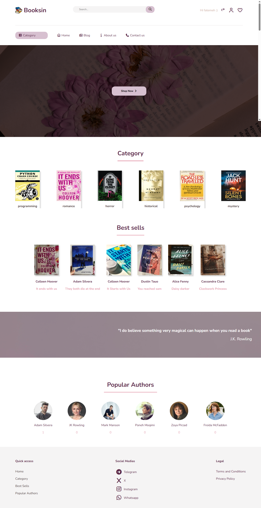
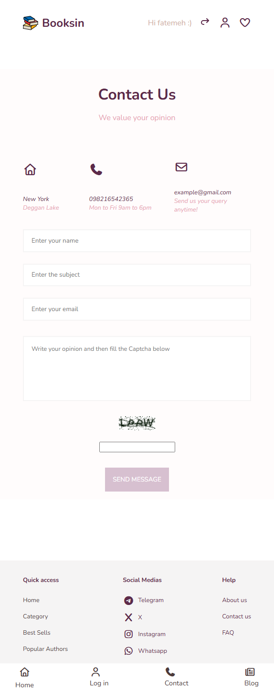
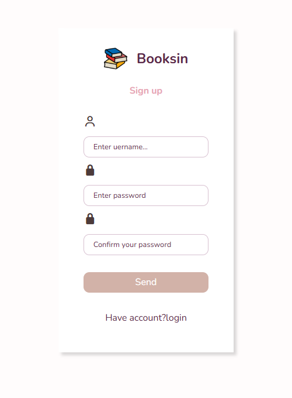
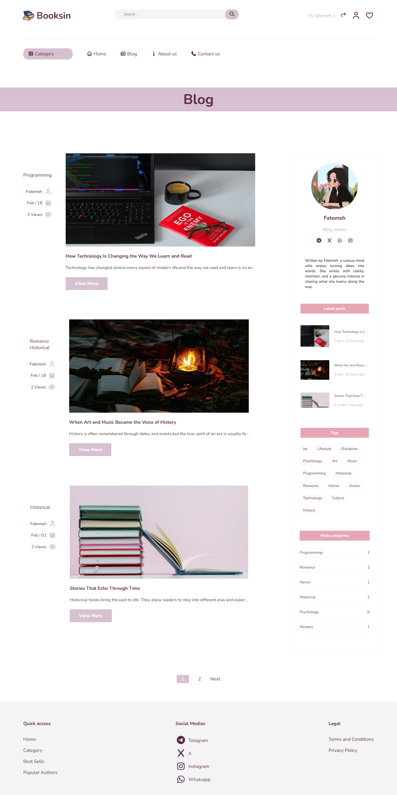
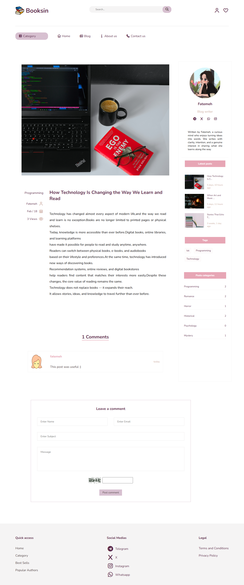
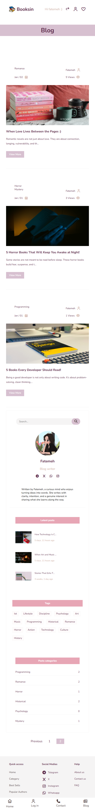

# 📚 Booksin Shop

A full-stack Django-based book shop and blogging platform built with a scalable architecture and clean separation of concerns.

Booksin Shop is a dynamic web application where book and author data are rendered from the database, and a fully functional blog system serves as the core content engine of the project.

The project focuses on backend-driven rendering, authentication workflows, SEO readiness, content management, and clean Django app architecture.

---

## 🚀 Project Overview

Booksin Shop consists of:

- A dynamic **home page** displaying:
  - Authors
  - Books
  - Best-selling items  
- A fully featured **blog system**
- User authentication system
- Comment moderation workflow
- SEO-friendly structure
- Responsive UI

The application is built using **Python & Django** with **SQLite3** as the database.

---

# 🧩 Core Features

## 📖 Blog System (Main Feature)

The blog is the central functional module of the project:

- Posts stored in the database
- Single post detail page
- Category-based filtering
- Tag-based filtering
- Author-based filtering
- Search functionality (searches inside post content)
- Pagination
- Sidebar showing latest 3 posts
- Comment system with admin approval
- Rich text content management using Summernote

---

## 👤 Authentication System (Accounts App)

Implemented using Django’s built-in authentication forms:

- User Registration
- Login
- Logout
- Display logged-in user’s name in the header
- CAPTCHA protection on forms

---

## 🏠 Core Pages (Core App)

- Home page (dynamic data rendering)
- About Us
- Contact Us

Book, author, and category information are fetched from the database and rendered dynamically.

---

## 💬 Comment Moderation System

Each blog post has its own comment section:

- Users can submit comments
- Comments are stored in DB
- Admin must approve comments
- Only approved comments are visible publicly

This mimics real-world production behavior.

---

## 🔎 Search System

A search box allows users to search inside post content.

Results are filtered using Django ORM queries.

---

## 🗂 Project Architecture

The project follows Django’s multi-app architecture:

```
booksin_shop/
│
├── accounts/     # Authentication logic
├── blog/         # Blog system
├── core/         # Home & static pages
│
├── templates/
├── static/
├── media/
├── db.sqlite3
└── manage.py
```

### Apps Breakdown

| App | Responsibility |
|------|---------------|
| accounts | Login, logout, signup |
| blog | Posts, categories, tags, comments |
| core | Homepage, About, Contact |

---

# 🎨 UI & Frontend

- Responsive design using Media Queries
- Icons: Font Awesome
- Typography: Google Fonts (Nunito)
- Static files organized inside `/static`
- Templates organized inside `/templates`

---

# 🛠 Tech Stack

### Backend
- Python 3
- Django
- SQLite3

### Frontend
- HTML5
- CSS3 (Flexbox & Media Queries)
- Font Awesome
- Google Fonts (Nunito)

### Admin Enhancements
- Django Admin
- Summernote (Rich text editor)

### SEO & Security
- Sitemap.xml
- robots.txt
- CAPTCHA protection

---

# 📸 Screenshots

Add your screenshots here in a 3x2 table with fixed size:

<table>
  <tr>
    <td></td>
    <td></td>
    <td></td>
  </tr>
  <tr>
    <td></td>
    <td></td>
    <td></td>
    
  </tr>
</table>

---

# ⚙️ Installation & Setup

Follow these steps to run the project locally:

## 1️⃣ Clone the Repository

```bash
git clone https://github.com/fatemeh-ch/booksin-shop.git
cd booksin-shop
```

## 2️⃣ Create Virtual Environment

```bash
python -m venv venv
source venv/bin/activate  # macOS/Linux
venv\Scripts\activate     # Windows
```

## 3️⃣ Install Dependencies

Install all required packages from `requirements.txt`:

```bash
pip install -r requirements.txt
```

---

## 4️⃣ Apply Migrations

```bash
python manage.py migrate
```

---

## 5️⃣ Create Superuser

```bash
python manage.py createsuperuser
```

---

## 6️⃣ Run Development Server

```bash
python manage.py runserver
```

Then open:

```
http://127.0.0.1:8000/
```

---

# 🔐 Admin Panel

Access:

```
http://127.0.0.1:8000/admin/
```

From here you can:

- Manage posts
- Approve comments
- Manage categories & tags
- Manage users

---

# 📈 SEO Structure

The project includes:

- Sitemap configuration
- robots.txt
- Structured blog URLs
- Pagination for performance optimization

---

# 🎯 Learning Objectives

This project demonstrates understanding of:

- Django app architecture
- Template inheritance
- ORM filtering & querying
- Authentication workflows
- Comment moderation systems
- Pagination
- Search implementation
- SEO basics
- Admin customization
- Responsive UI design

---

# 📌 Project Status

🟢 Functional & Extendable  
🔵 Open for improvement and feature scaling  

---

# 👩‍💻 Author

Fatemeh  
Computer Engineering Student  
Backend-Oriented Web Developer (Django)

---

# ⭐ Why This Project Matters

Booksin Shop is not just a template project —  
It demonstrates real backend logic, content workflows, and production-like behaviors such as moderation, search, pagination, and SEO handling.

It reflects practical understanding of Django fundamentals and scalable web application structure.